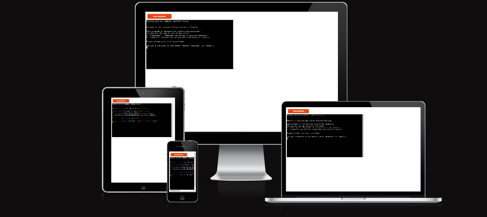

# Customer Survey Analysis

The Customer Survey Analysis Program is a Python-based application designed to handle, analyze, and report on customer feedback. This project integrates Google Sheets for data storage and employs various Python modules to manage user interactions, process survey responses, and generate insightful reports. Users can interact with the application as either a Customer or Owner. Customers provide feedback through a survey, while owners analyze the collected data and generate reports.

You can access the live version of the application [here](https://customer-survey-analysis-f7747660b229.herokuapp.com/).

You can access the Google Spreadsheet [here](https://docs.google.com/spreadsheets/d/1K-I3y8vp4AlnknqPFVrDW6I7B1lf7syxYzSH7QMOOrY/edit?usp=sharing)

## Table of Contents

1. [Project Overview](#project-overview)
2. [Design and Architecture](#design-and-architecture)
3. [Features](#features)
4. [Deployment](#deployment)
5. [Credits](#credits)

## 1. Project Overview

The Customer Survey Analysis Program aims to facilitate the efficient collection and analysis of customer feedback. This project leverages Google Sheets for data storage and uses Python to handle different roles, process survey responses, and generate analytical reports. The application is designed to provide valuable insights into customer satisfaction and identify areas for improvement.

### 1.1 User Stories

#### As a Customer, I want to:

- **Provide Feedback**: Complete a survey to rate various aspects of the service, including overall satisfaction, product quality, customer support, and willingness to recommend the service.
- **Receive Confirmation**: Get a confirmation message after submitting the survey, thanking me for my feedback and letting me know that my responses have been recorded.

#### As an Owner, I want to:

- **Analyze Data**: Access survey responses to analyze overall customer satisfaction, product quality, customer support, and recommendation scores.
- **Generate Reports**: Export the analysis results to a CSV file and view detailed feedback based on average ratings.
- **Update Analysis**: See real-time updates of survey results and feedback in the Google Sheets analysis worksheet.
- **Print and Review**: Print or view the contents of the generated CSV file to review the analysis data.

[Customer Survey Analysis Spreadsheet](https://docs.google.com/spreadsheets/d/1K-I3y8vp4AlnknqPFVrDW6I7B1lf7syxYzSH7QMOOrY/edit?usp=sharing)

## 2. Design and Architecture

### Modular Design

The project is structured into separate modules to improve maintainability, readability, and scalability. Each module focuses on a specific aspect of the application:

- **google_sheet.py**: Handles Google Sheets API integration and provides methods to access and manipulate worksheets.
- **survey_module.py**: Manages customer survey responses, including collection, validation, and updating the survey worksheet.
- **analysis_module.py**: Analyzes survey data, calculates averages, provides feedback, and exports analysis reports to CSV.

This modular approach allows for clear separation of concerns, making the codebase easier to manage and extend. Each module encapsulates its functionality, promoting reusability and simplifying testing.

### Object-Oriented Programming (OOP)

The application utilizes object-oriented programming principles to enhance the design and functionality:

- **Classes**: Key components of the application are represented as classes. These classes encapsulate related data and behaviors, making the code more organized and easier to understand.
- **Encapsulation**: Each class encapsulates specific functionality, such as handling survey data or analyzing results, which helps in isolating changes and reducing dependencies.
- **Modularity**: By using classes, the project leverages OOP principles to create modular, self-contained units of functionality that can be independently developed and tested.

This object-oriented design pattern enhances code readability, reusability, and maintainability, aligning with best practices in software development.

### Data Model

The project uses the following data model to structure and store survey responses:

- **Survey Responses**: Each response consists of the following fields:

  - **Customer ID**: A unique identifier for each customer.
  - **Overall Satisfaction**: Rating from 1 to 5.
  - **Product Quality**: Rating from 1 to 5.
  - **Customer Support**: Rating from 1 to 5.
  - **Recommendation**: Rating from 1 to 5.

  

The data is stored in a Google Sheets document with separate worksheets for survey responses and analysis results.

## 3. Features

### 3.1 Google Sheet Integration (GoogleSheet)

Manages authentication and access to Google Sheets through the API, providing functionality to interact with specific worksheets within a Google Sheets document.

- \***\*init\*\***(self, sheet_name)

Sets up the Google Sheets API client with necessary credentials and scopes. Opens the Google Sheets document specified by **sheet_name**.

- **get_worksheet**(self, worksheet_name)

Fetches a worksheet object by its name, allowing operations such as reading and writing data to the specified worksheet.

### 3.2 Main (run.py)

The **run.py** script serves as the central controller of the application. It is responsible for initializing components, managing user interactions, and directing the flow based on user roles.

- **main**()

The **main()** function initiates the program by displaying a welcome message, initializing the Google Sheets connection, and entering a loop to process user inputs and role-based actions.

- **handle_user_role**(user_role, google_sheet)

Determines the appropriate action based on the user’s role input. It either directs the user to customer-specific or owner-specific functionalities or exits the program. It also handles exceptions that may occur during the process.

- **handle_customer_role**(google_sheet)

Handles operations for the customer role, including creating a **Survey** instance, collecting responses, and updating the Google Sheet with the collected data.

- **validate_password**()

  
  

Validates the password required for accessing owner functionalities. The password is known to the user before the program asks them to enter it, which allows the program to be evaluated effectively. The password is checked against a predefined value. The _password.py_ file containing the password is not included in the _.gitignore_ file to facilitate deployment on Heroku.

- **handle_owner_role**(google_sheet)

Manages the owner role, which involves validating the password, performing survey analysis, and presenting various functionalities related to data analysis.

- **get_user_continue_response**()

Asks the user if they want to perform another action. Continuously prompts until a valid response (**'yes'** or **'no'**) is received.

- **display_welcome_message**()

Displays a welcome message introducing the program and informing the user about the available roles and their purposes.

### 3.3 Survey Module (Survey)

Handles customer survey responses by collecting, validating, and updating data in the Google Sheets worksheet.

- \***\*init\*\***(self, google_sheet)

Initializes the **Survey** class with a reference to the Google Sheets worksheet designated for survey responses.

- **get_customer_answers**(self)

Collects responses from customers through a series of questions, validates the input, and assigns a unique customer ID.

- **validate_response**(self, response)

Validates the customer responses to ensure they are numeric values between **1** and **5**.

- **get_last_customer_id**(self)

Retrieves the last customer ID from the survey worksheet to generate a new, unique ID for the current customer.

- **update_survey_worksheet**(self, data)

Updates the survey worksheet with a new row of data, including customer responses.

### 3.4 Analysis Module (Analysis)

Manages the analysis of survey data, provides feedback, and exports analysis results to a CSV file.

- \***\*init\*\***(self, google_sheet)

Initializes the **Analysis** class with references to components needed for data analysis, including **SurveyDataAnalyzer**, **FeedbackProvider**, and **ReportExporter**.

- **update_analysis_worksheet**(self)

Updates the analysis worksheet with the latest survey averages and the number of responses.

- **display_functionality_menu**(self)

Displays a menu of available functionalities for analyzing and exporting survey data, and handles user selections.

- **handle_export_csv**(self)

Prompts the user to confirm exporting analysis data to a CSV file and handles the export process.

- **import_csv_to_report**(self, csv_file_path)

Imports data from a CSV file into the **'report'** worksheet of Google Sheets.

- **print_survey_averages**(self)

Retrieves and prints the average ratings for each survey criterion.

- **FeedbackProvider Class**

Provides feedback messages based on average survey ratings, mapping average scores to predefined feedback.

- \***\*init\*\***(self)

Initializes the **FeedbackProvider** with a set of predefined feedback messages corresponding to different average scores.

- **provide_feedback**(self, averages)

Prints feedback messages based on the calculated survey averages.

- **get_feedback_message**(self, score)

Returns the feedback message associated with a specific score.

- **ReportExporter Class**

Handles exporting survey analysis data to a CSV file and printing the file’s contents.

- \***\*init\*\***(self, survey_data_analyzer)

Initializes the **ReportExporter** with a reference to the **SurveyDataAnalyzer** instance for accessing survey data.

- **export_analysis_to_csv**(self)

Exports analysis data to a CSV file, including creating directories, writing data, and handling file operations.

- **print_csv_contents**(self)

Reads and prints the contents of the CSV file to the console.

### Potential Features

#### Order Tracking and Survey Comparison

- **Track Orders**: Integrate an order tracking system to record and manage customer orders.
- **Survey Submission Comparison**: Implement a feature that calculates and compares the number of survey submissions against the total number of orders to determine the survey response rate.

#### Survey Tracking by Customer ID

- **Track Specific Surveys**: Allow the owner to track individual surveys by customer ID, including:
  - **View Responses**: Retrieve and view responses for a specific customer ID.
  - **Update or Edit Responses**: Provide options to update or correct responses.
  - **Search and Filter**: Enable search and filter options to quickly locate specific survey entries.

#### Date Tracking for Survey Submissions

- **Timestamp Submissions**: Add a timestamp to each survey submission to track when feedback was provided.
- **Date Column**: Include a date column in the survey worksheet.
- **Date-based Analysis**: Analyze survey data based on specific timeframes such as weekly, monthly, or quarterly.
- **Trends and Insights**: Generate reports or visualizations to highlight trends over time.

## 4. Testing

### Manual Testing

1. **Code Review**: Passed the code through flake8 for PEP8 compliance. No major issues were found.
2. **Input Validation**: Tested with invalid inputs in all cases:
   - Strings where numbers were expected.
   - Numbers outside the valid range.
   - Numbers where strings were required.
3. **Environment Testing**: Tested in the local terminal and Code Institute Heroku terminal.

### 5. Bugs

Initially, I used a procedural programming approach for the project. However, during the process of refactoring the code to adopt object-oriented programming principles, I encountered and resolved several bugs. The transition aimed to improve code organization and maintainability by introducing classes and objects. Most of the troubles were related to:

- **Refactoring Issues**: Challenges in restructuring code to fit an object-oriented paradigm, including adapting functions to methods and managing class interactions.
- **Inheritance Problems**: Difficulties in establishing correct parent-child relationships between classes and ensuring that inherited methods and properties functioned as intended.

#### Solved Bugs:

- **Bug 1**: An error occurred while processing survey analysis due to an undefined method.  
  **Solution**: Added the appropriate method reference.

- **Bug 2**: An error occurred because a required argument was missing when appending a row to the worksheet.

  

  **Solution**: Passed the necessary data as an argument to the method.

  

- **Bug 3**: The method for printing CSV contents was displaying data as a list instead of a comma-separated string.  
  **Solution**: Adjusted the method to join list items into a string for proper display.

  

- **Bug 4**: If the user chose to exit the menu, the program did not ask if they wanted to proceed or exit.  
  **Solution**: Implemented a prompt to confirm whether the user wanted to perform another action or exit.

  

- **Bug 5**: At the start of the program, there was no option to exit.  
  **Solution**: Added an option to exit the program at the initial user interface.

  

### Validator Testing

Installed flake8 in VS Code and passed the code for evaluation. Only a few major errors were displayed. Some lines were longer than expected (mostly due to inline comments) and a few unnecessary whitespaces were found.

## 6. Deployment

The project is deployed using Code Institute's Mock Terminal for Heroku.

### Steps:

1. **Clone the Python Essentials Template from Code Institute**: Start by cloning the template repository provided by Code Institute to use as a base for your project.

2. **Create a New Heroku App**: Set up a new application on Heroku to host your project.

3. **Set Two Config Vars**: Configure the necessary environment variables:

   - **CREDS**: Add your credentials for Google Sheets API.
   - **PASSWORD**: Provide the password for owner access (note that the password file is not included in the _.gitignore_ file for assessment purposes).

4. **Set the Buildpacks to Python and Node.js**: Ensure that the Heroku app is set to use both Python and Node.js buildpacks to handle the project's dependencies.

5. **Link the Heroku App to the Repository**: Connect your Heroku app to the Git repository where your code is hosted.

6. **Click on Deploy**: Deploy the application by triggering the deployment process through the Heroku dashboard or terminal.

7. **Link the Heroku App to the Repository**: Connect your Heroku app to the Git repository where your code is hosted.

## 7. Credits

### Contributors

- **George**: Primary developer.
- [**Code Institute**](https://codeinstitute.net/global/): Additional development and support.

### Libraries and Tools

- **Google Sheets API**: For managing and storing survey data.
- **gspread**: Python library used for interacting with Google Sheets.
- **Python**: Programming language used for developing the application.
- **Heroku**: Platform for deploying the application.
- [**Code Institute**](https://codeinstitute.net/global/): For providing the Python Essentials Template and mock terminal for Heroku deployment.

### Resources

- [**Python 3.12.6 documentation**](https://docs.python.org/3/) : For providing guidance on structuring and formatting the project.
- [**Stack Overflow**](https://stackoverflow.com/): For troubleshooting and code-related questions.
- [**ChatGPT**](https://chat.openai.com/) : For assistance with programming queries and code explanations.
- [**Make a README**](https://www.makeareadme.com/): For providing guidance on structuring and formatting the README.
- [**AmiResponsive**](https://ui.dev/amiresponsive) : For generating responsive design screenshots.
